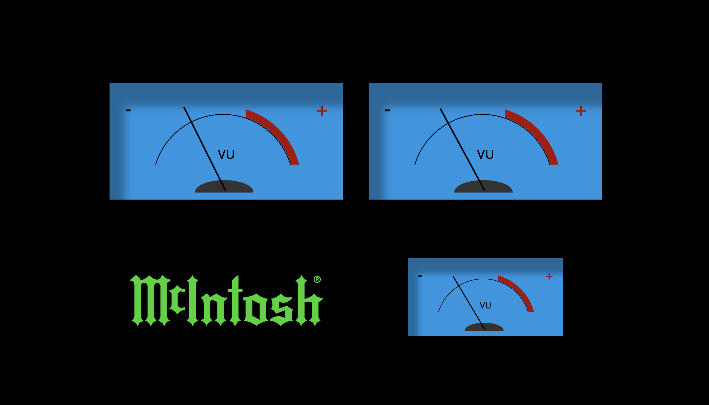

# VU Meter for CamillaDSP

A fun little project to show some VU Meters for CamillaDSP.

In my setup I have a Motu M4 which stereo in the first two channels and the sub on the third channel. I use the handy websocket reports from CamillaDSP to refresh the meters.

##  Instructions

1. Copy files to your computer.
2.  Update the `config.js` file to get the url for camillaDSP websocket.
3.  Load the `vumeter.html` page in your browser..
 
## Sources

- Stereo VU Meters by Michael Levy at  https://codepen.io/michaelslevy/pen/rRPyaO
- McIntosh logo from Wikipedia https://en.wikipedia.org/wiki/McIntosh_Laboratory
- CamillaDSP by   
Henrik Enquist at https://github.com/HEnquist/camilladsp
- RPi4 + CamillaDSP Tutorial by mdsimon2 at https://www.audiosciencereview.com/forum/index.php?threads/rpi4-camilladsp-tutorial.29656/

