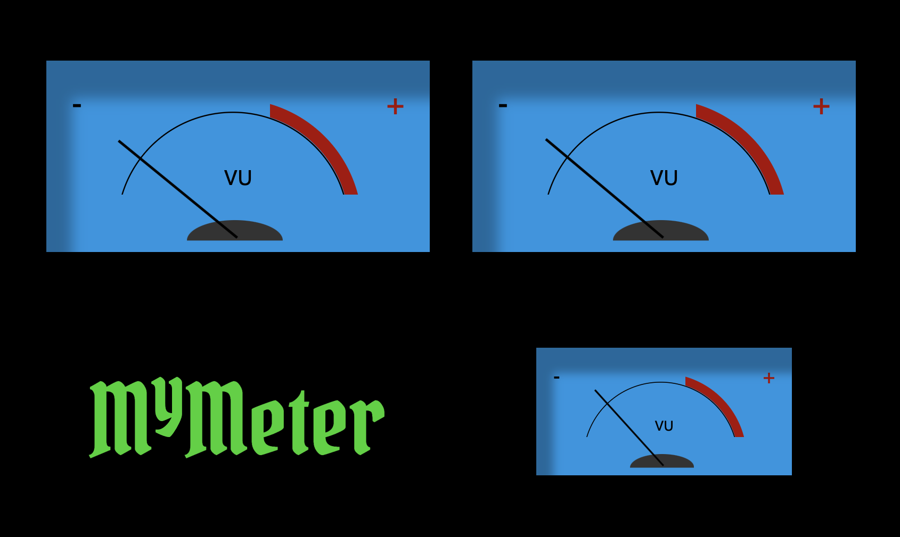

# VU Meter for CamillaDSP

A fun little project to show some VU Meters for CamillaDSP.

In my setup I have a Motu M4 with the first two output channels for stereo and the third one
is the subwoofer. Connection to CamillaDSP is via websocket.

##  Instructions

1. Copy files to your computer.
2.  Update the `config.js` file to set the url for camillaDSP websocket.
3.  Load the `index.html` page in your browser.

## Display

- Raspberry Pi 4
- 
- Raspbian OS

## Raspberry pi
## Sources

- Stereo VU Meters by Michael Levy at  https://codepen.io/michaelslevy/pen/rRPyaO
- CamillaDSP by   
Henrik Enquist at https://github.com/HEnquist/camilladsp
- RPi4 + CamillaDSP Tutorial by mdsimon2 at https://www.audiosciencereview.com/forum/index.php?threads/rpi4-camilladsp-tutorial.29656/
- Pirate One font by Google at https://fonts.google.com/specimen/Pirata+One
- McIntosh logo from Wikipedia https://en.wikipedia.org/wiki/McIntosh_Laboratory

